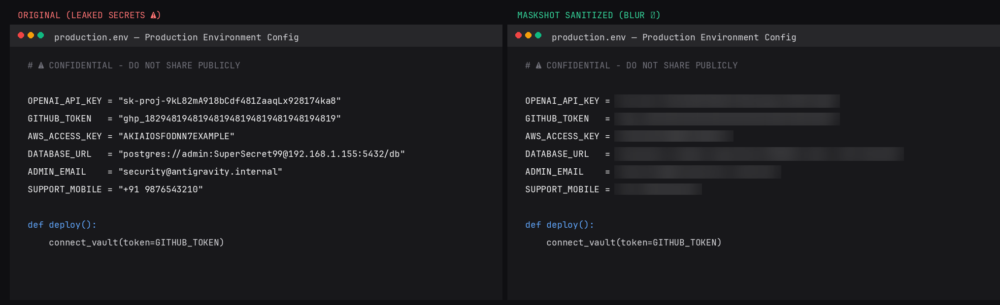
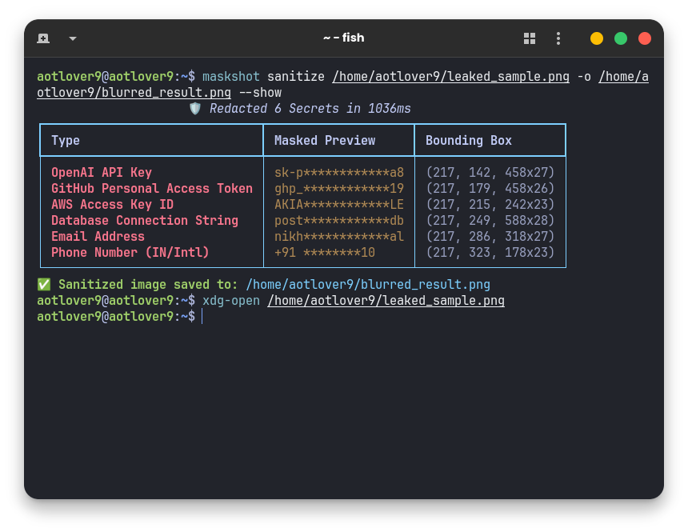

# maskshot

> Fast, offline CLI & clipboard sanitizer. Automatically blurs API keys, tokens, and credentials in screenshots before posting online.



## Features

- **100% Offline:** Runs locally via Tesseract OCR. Zero cloud calls, zero API costs.
- **Fast:** Sanitizes clipboard images in `< 300ms`.
- **Built-in Detection:** OpenAI, Anthropic, GitHub, AWS, Google Cloud, Stripe, Slack tokens, database connection strings, passwords in code, emails, phone numbers, and IPs.
- **Customizable:** Add custom private keywords or regex patterns via `~/.config/maskshot/config.yaml`.

## Installation

### 1. Prerequisites (Tesseract)

```bash
# Ubuntu / Debian
sudo apt install tesseract-ocr

# Arch / Manjaro / CachyOS
sudo pacman -S tesseract tesseract-data-eng

# Fedora
sudo dnf install tesseract
```

### 2. Install

```bash
pip install git+https://github.com/aotlover9-base-eth/maskshot.git
```

*(Or via `uv`: `uv tool install git+https://github.com/aotlover9-base-eth/maskshot.git`)*

## Usage

### Sanitize Clipboard
Take a screenshot, then run:

```bash
maskshot clip
```
The image in your clipboard is replaced with the redacted version, ready to paste (`Ctrl + V`).

### Sanitize an Image File

```bash
# Gaussian blur (default)
maskshot sanitize screenshot.png -o clean.png

# Pixelate style
maskshot sanitize screenshot.png -s pixelate -o clean.png

# Blackout with category labels
maskshot sanitize screenshot.png -s blackout --badge -o clean.png
```



### Background Watcher
Auto-sanitize screenshots as they are saved to a directory:

```bash
maskshot watch ~/Pictures/Screenshots
```

## Custom Rules

Add your own keywords or regex patterns in `~/.config/maskshot/config.yaml`:

```yaml
custom_keywords:
  - "MySecretProject"
  - "internal-company-name"

custom_rules:
  - name: "Employee ID"
    pattern: "EMP-[0-9]{5}"
```

View all active rules:
```bash
maskshot rules
```

## License

MIT © 2026 Nikhil Gupta. Part of [100 Days, 100 Problems, 100 Solutions](https://github.com/aotlover9-base-eth/100-days-100-problems-100-solutions).
